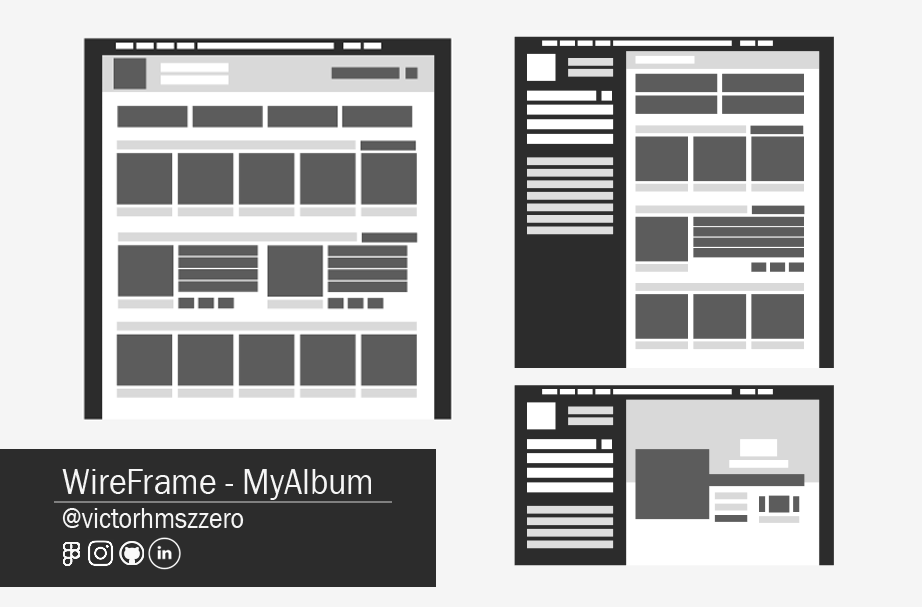

# MyAlbum
A prototipação de um site de música contendo minha escolha de músicas e baseado no falecido Google Music, Soundcloud e Spotify.    

   

## Objetivo deste projeto
Esse álbum deve conter:   
* **Pagina inicial** que contenha as músicas que me descrevam e que são importantes para minha pessoa;       
* **Páginas separadas** para representar cada musica;        
* **Letra** para descrever no mínimo uma música escolhida.

### Criação do projeto
Apos a criação de wireframes separei as ideias e funcionalidades que conseguiria realizar e implantar no projeto e desenvolver formas e alternativas para não abandonar ideias já definidas.     
O *Menu hamburguer* foi uma forma que encontrei de tornar o site *responsivo* já que ele pode ser ativado a qualquer momento redimensionando o layout em telas grandes e pequenas.    
A tarefa mais difícil foi separar as músicas já que elas precisavam me representar de certa forma.

>Fiquei muito feliz com que conquistei com esse projeto a organização foi um fator muito importante e a "experiencia" do Figma em meus projetos anteriores me ajudou a
utilizar mais recursos da ferramenta.    

[
Clique aqui para visualizar projeto no Figma](https://www.figma.com/proto/ynPdAfzKT8S4CENHJ8n4qi/My-Playlist?page-id=0%3A1&node-id=1%3A3&starting-point-node-id=1%3A3&scaling=scale-down-width&hotspot-hints=0&hide-ui=1).
